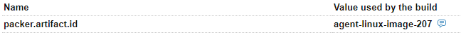
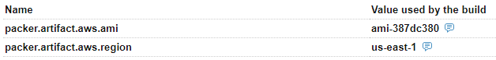
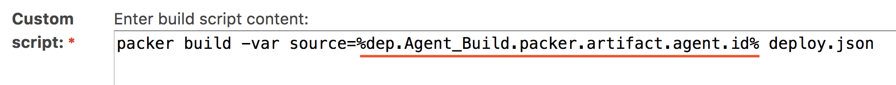

# Packer Post-Processor for TeamСity

HashiCorp Packer generates image IDs, like `ami-387dc380`.
When creating a build chain with separate configurations for building, testing, and deploying images, we need to reference their IDs.

This is a Packer plugin, which saves the generated image IDs as parameters in the build history:


Packer can run multiple builders in parallel, so a single build can produce several artifacts. Custom builder names can be used to distinguish them. 

For AMIs in AWS, there is a special format, two parameters are published for each artifact:


Now dependent build configurations can reference these parameters and resolve the image IDs dynamically:


## Usage

1. Download the binaries from the [Releases](https://github.com/JetBrains/packer-post-processor-teamcity/releases) page.
2. [Install](https://www.packer.io/docs/extending/plugins.html#installing-plugins) the plugin on build agents.
3. Add the TeamCity post-processor to Packer configurations:
```json
{
  "builders": [
    {
      "name":"agent",
      "type": "amazon-ebs",
      
      .......
    }
  ],
  "post-processors": [
    "teamcity"
  ]
}
```

## Register TeamCity Cloud Agent Images

Optionally the plugin can be used to deploy new versions of TeamCity cloud agents: after the images are created Packer registrs them in cloud agent profiles on TeamCity server:

| This feature works with vSphere only. See #3 |
| --- |

```json
{
  "builders": [
    {
      "name": "agent",
      .......
    }
  ],
  "post-processors": [
    {
      "type": "teamcity",
      "teamcity_url": "https://teamcity.local",
      "username": "admin",
      "password": "secret",
      "project_id": "_Root",
      "custom_image_name": "{{build_name}}",
      "agent_name": "{{build_name}}-{{user `build_number`}}"
    }
  ]
}

```
